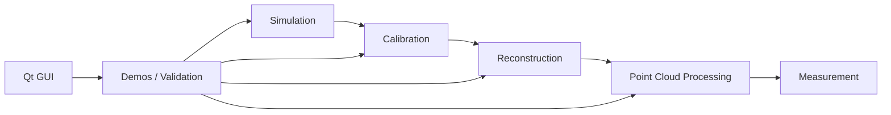

# Architecture

Laser Scanner Toolkit is organized as a small layered C++ library plus optional demos, validation programs, and a Qt GUI.

## Layers

- `core`: shared types, file I/O, ray-plane math, laser-line extraction, logging, and result/error helpers.
- `sim`: synthetic scanner and target generation.
- `calib`: camera, light-plane, and motion-axis calibration.
- `recon`: scan-line to 3D point-cloud reconstruction.
- `proc`: point-cloud filtering, segmentation, and measurement.
- `hal`: abstract interfaces for future real camera and motion-controller integrations.
- `viz`: optional visualization adapters.

The default build avoids heavyweight optional dependencies. Python bindings, Open3D visualization, fuzzing, coverage, and benchmarks are enabled through explicit CMake options.

## Evidence Pipeline

The full-pipeline demo publishes two machine-readable streams to the GUI:

- `[IMAGE ...]` announces an input image as soon as it is written, enabling live display.
- `[LSC_DETAIL]` links that input to a diagnostic overlay, algorithm name, and measured values.

The detail record is tab-separated because Windows paths may contain spaces. The GUI does not recalculate results; it displays evidence produced by the same executable that performed the inspection. This keeps calibration acceptance, numeric results, and visual evidence under one source of truth.

Diagnostic outputs are stored in `output/diagnostics`:

- Chessboard overlays show detected corners and the center used by `solvePnP`.
- Light-plane overlays combine board corners with extracted subpixel laser centers.
- Scan overlays show the 2D laser centers used for ray-plane triangulation.
- Point-cloud views show reconstruction, filtering, downsampling, RANSAC classification, and measurement zones.

## Core Mathematics

1. **Laser center extraction:** gray-centroid computes an intensity-weighted row in each image column. Steger extraction uses the Hessian eigenvector normal to the bright ridge and a second-order Taylor expansion for subpixel localization.
2. **Triangulation:** pixel `(u,v)` becomes camera ray `r=((u-cx)/fx,(v-cy)/fy,1)`. For plane `n·P+D=0`, the intersection is `P=(-D/(n·r))r`.
3. **Light-plane calibration:** `solvePnP` recovers each board plane. Extracted laser rays intersect those planes, and SVD fits one plane through the accumulated 3D intersections.
4. **Motion-axis calibration:** board centers recovered by `solvePnP` form a 3D trajectory. PCA supplies its dominant direction; known positions resolve the direction sign.
5. **Point-cloud processing:** KD-tree neighborhood statistics remove isolated points, voxel centroids reduce density, and RANSAC plus SVD estimates a dominant plane.
6. **Measurement:** robust regional Z statistics produce step heights. Grid cells on a reference plane use median signed height, and `area × height` is summed to estimate volume.
